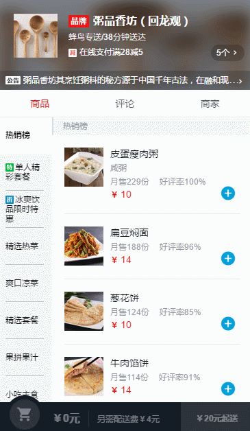
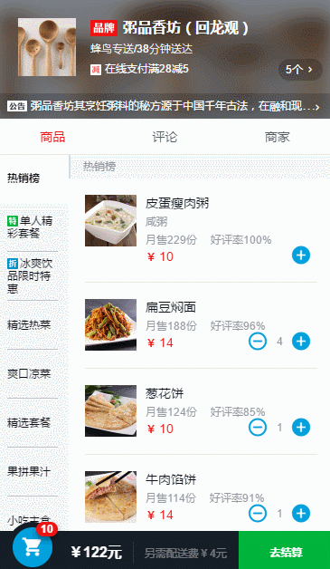

  
# 技术栈
* MVVM框架：Vue.js
* 前端路由： Vue-router
* 滚动插件： Better-scroll
* 构建工具： 基于 webpack 的 vue-cli
* CSS 预处理器： Stylus
# 重点总结
* 小球下落动画
> 在 cartcontrol 组件触发 addCart 事件，该事件向父组件 food 提交（emit）cartadd 事件，并传入 event.target在 food 组件再次提交（emit）一个 caradd 事件，提交到父组件 good 上。goods 组件触发了子组件 shopcart 的drop事件，drop 事件就可以处理小球下落动画了
* 接后台数据
> 与后台的配合,通过插vue.resource + node 的 express 连接得到数据
* 购物车
* 1 像素边框问题
> 通过 media query 查出客户端的像素比，然后根据不同的像素比，利用 transform:scale() 进行缩放
* flex 布局
* Sticky footer
* Lazy-load

